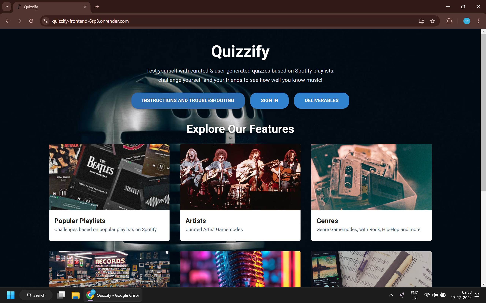
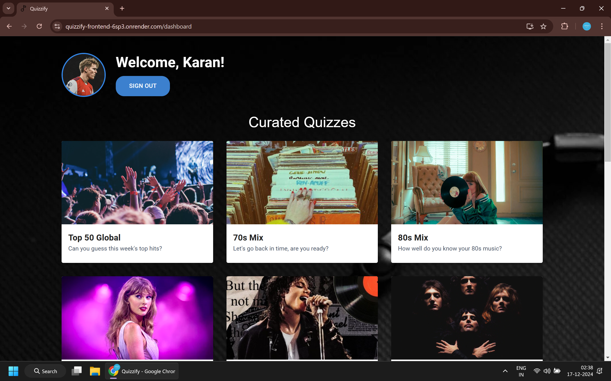
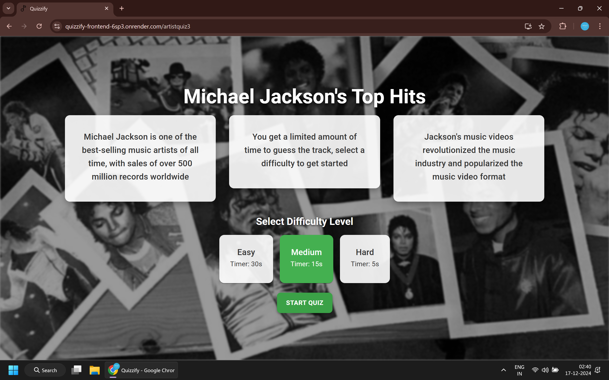
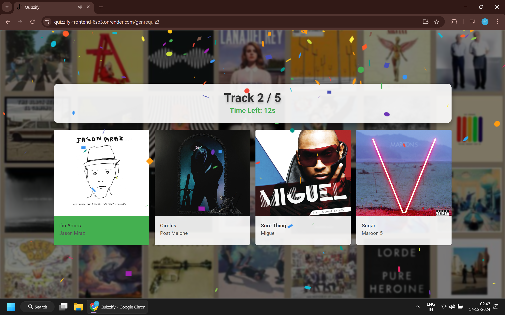
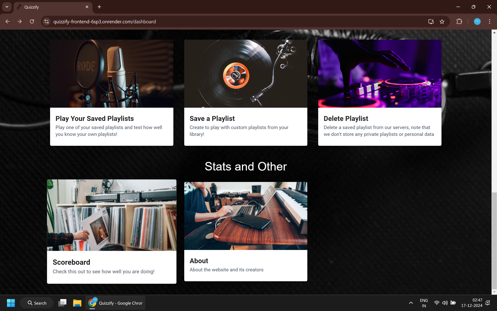
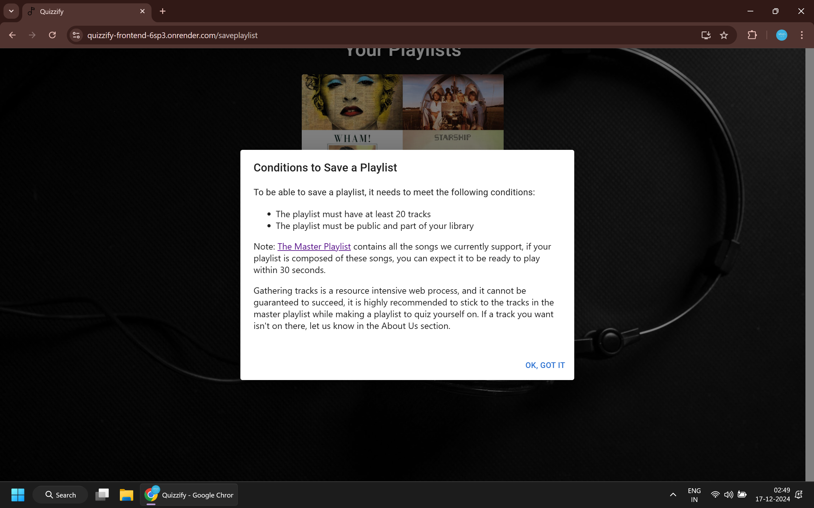
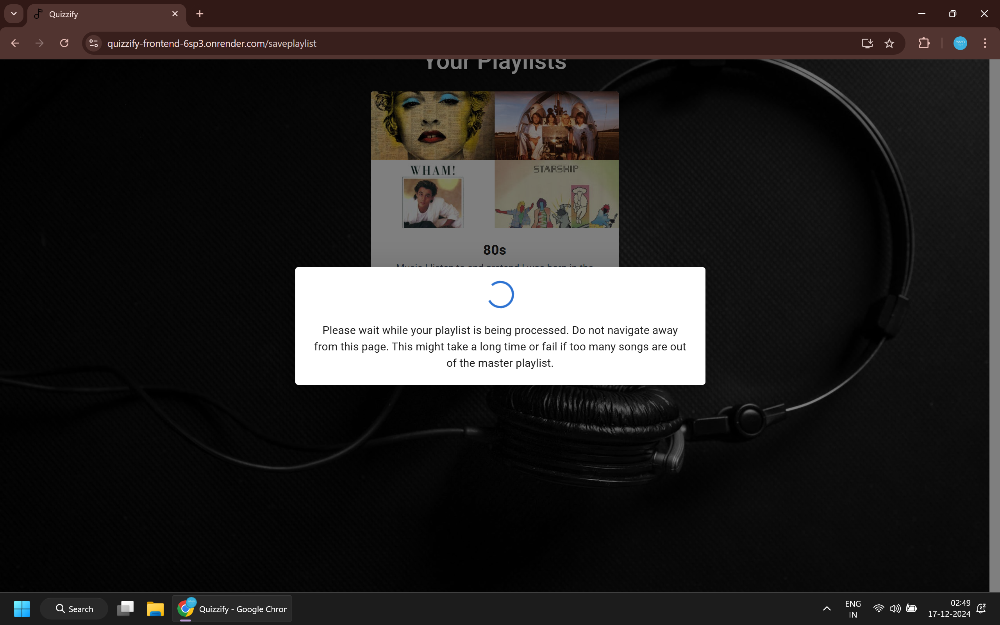
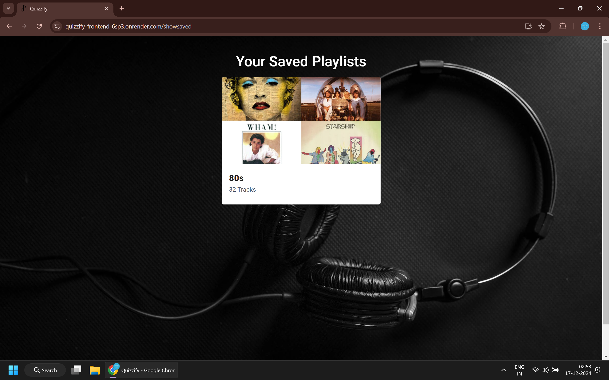
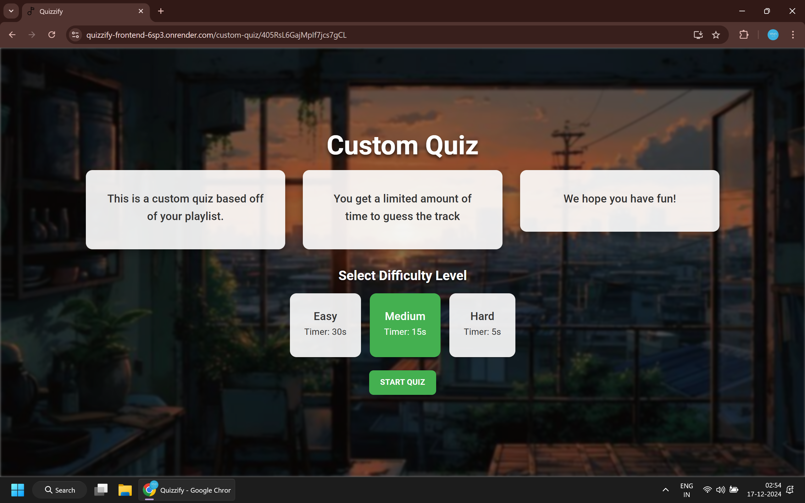

# Quizzify

[](https://quizzify.space)


A Spotify-powered music quiz app where users test their knowledge on curated playlists, artist deep dives, genre challenges, and their own Spotify library.

> **Note:** Spotify's development mode requires whitelisted accounts. To try the live demo, email [karansreedhar15@gmail.com](mailto:karansreedhar15@gmail.com) or [srinath.ganesh@outlook.com](mailto:srinath.ganesh@outlook.com) with your Spotify account email.

---

## Architecture

```
┌─────────────────┐     ┌─────────────────┐     ┌─────────────────┐
│    Frontend      │────▶│    Backend       │────▶│    Scraper       │
│  React 18 SPA    │     │  FastAPI + Mongo │     │ FastAPI+Playwright│
│  quizzify.space  │     │ api.quizzify.space│    │  (Google Cloud)  │
└─────────────────┘     └─────────────────┘     └─────────────────┘
        │                        │
        │   Spotify OAuth        │   MongoDB Atlas
        └────────────────────────┘
```

**Auth flow:** Frontend redirects to backend `/login` → Spotify OAuth → callback sets HTTP-only cookie → frontend sends cookie automatically with every request.

**Quiz flow:** Frontend POSTs playlist ID → backend picks 5 random tracks from MongoDB → generates 4-option questions → user answers with countdown timer → score saved to database.

---

## Features

- **Curated quizzes** — Top 50 Global, Taylor Swift, Queen, Michael Jackson, 70s/80s, Rock, Pop, Rap
- **Custom quizzes** — import any Spotify playlist (20+ tracks) and quiz yourself
- **Difficulty levels** — Easy (30s), Medium (15s), Hard (5s) countdown timers
- **Score tracking** — persistent scoreboard with per-quiz performance stats
- **Audio previews** — listen to track clips and guess the song + artist
- **Playlist scraper** — Playwright-based microservice scrapes Apple Music for preview URLs when Spotify doesn't provide them

---

## Screenshots


*Landing page with sign-in and demo carousel*


*Dashboard with curated and custom quiz options*


*Difficulty selection before starting a quiz*


*Quiz in action with countdown timer and answer feedback*


*Score tracking with per-quiz performance breakdown*


*Conditions for saving a custom playlist*


*Playlist processing in progress*


*Saved playlists ready for custom quizzes*


*Custom quiz gameplay*

---

## Getting Started

### Prerequisites

- Node.js 18+
- Python 3.10+
- MongoDB Atlas account (or local MongoDB)
- [Spotify Developer App](https://developer.spotify.com/dashboard) with redirect URI `http://127.0.0.1:8000/callback`

### Setup

1. **Clone the repo**
   ```bash
   git clone https://github.com/your-username/quizzify.git
   cd quizzify/spotify-quiz-app
   ```

2. **Backend**
   ```bash
   cd backend
   cp .env.example .env
   # Fill in your Spotify credentials and MongoDB URI in .env
   pip install -r requirements.txt
   uvicorn main:app --port 8000 --reload
   ```

3. **Frontend**
   ```bash
   cd frontend
   cp .env.example .env
   # Ensure REACT_APP_API_URL=http://127.0.0.1:8000
   npm install
   npm start
   ```

4. **Scraper (optional)** — only needed for importing custom playlists with missing preview URLs
   ```bash
   cd scraper
   pip install -r requirements.txt
   uvicorn main:app --port 8001 --reload
   ```

5. Open `http://localhost:3000` and sign in with Spotify.

---

## Tech Stack

| Layer | Technology |
|-------|------------|
| Frontend | React 18, React Router v6, Material UI v6, Framer Motion, Axios |
| Backend | FastAPI, Spotipy, PyMongo, Pydantic |
| Database | MongoDB Atlas |
| Scraper | FastAPI, Playwright (Chromium) |
| Auth | Spotify OAuth 2.0 (HTTP-only cookies) |
| Deployment | Render (frontend + backend), Google Cloud (scraper) |

---

## License

[MIT](LICENSE)
