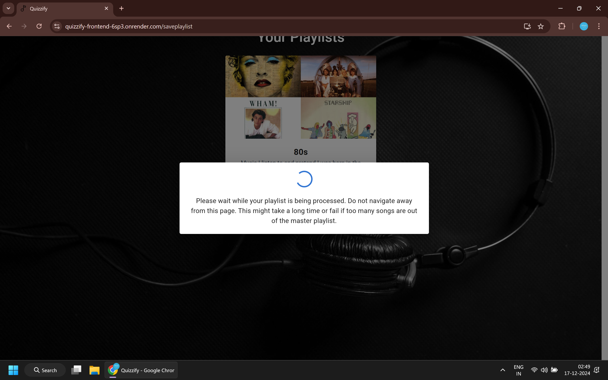

# Quizzify - A Spotify Quiz App

A fun and interactive quiz app built around Spotify's music catalog, where users can test their knowledge of songs, artists, and genres. This project demonstrates ability to work with web APIs, backend technologies, and frontend design, along with an engaging user experience.

---

## Table of Contents
1. [Demo](#demo)
2. [Features](#features)
3. [Tech Stack](#tech-stack)
4. [Screenshots](#screenshots)

---

## Demo

You can try out the live demo of the Spotify Quiz App here:

ALERT: Authorised User Required for Demo, contact authors if interested in trying out the demo

[Live Demo Link](https://quizzify-frontend-6sp3.onrender.com/)

---

## Features

**Website Features**

- **Track Name and Artist Guessing**: Users guess the song and artist based on a short preview clip
- **Web Scraping**: Playwright based scraping for PreviewURL caching
- **Custom Quizzes**: Users can provide a quiz of their own to quiz themselves
- **Multiple Gamemodes**: Users can choose from a curated list of playlists to quiz themselves on
- **Score Tracking**: Keep track of your score as you progress through the quizzes, and save it for viewing later
- **Difficulty Based Quiz Timer**: Each question has a countdown timer for added challenge, which is determined by Difficulty level
- **Spotify Integration**: Uses Spotify’s Web API to fetch songs, user playlists, album art, etc.

---

## Tech Stack

- **Frontend**: ReactJS
- **Backend**: FastAPI (Python)
- **Scraper**: Playwright (Python)
- **Database**: MongoDB
- **Authentication**: Spotify API
- **Deployment**: Render -> Frontend & Backend, Google Cloud -> Scraping

---

## Screenshots

*The Landing Page where the users are led to first*

*The Dashboard where users can choose their preferred gamemode* 

*The Quiz start page where users pick difficulty* 

*The Quiz Page, where users play the quiz, with a time limit for each track, and animations to indicate if the guess is correct* 

*The score are saved on quiz completion and are viewable in the scoreboard section on the Dashboard* 

*The score are saved on quiz completion and are viewable in the scoreboard section on the Dashboard* 

*Users can save a playlist, provided it meets the conditions* 

*Playlist is saved after submitting* 

*Users can then select their saved playlist to play custom game mode*

*Custom Quiz UI*
---
